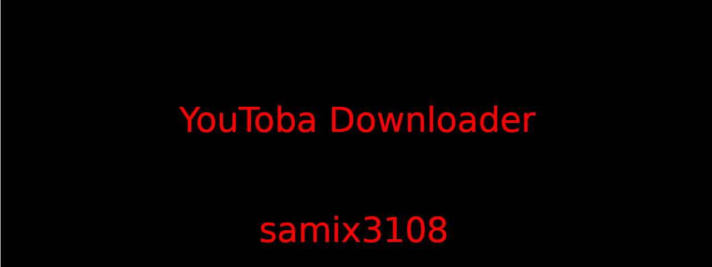

**YouTuba Downloader** é uma ferramenta para baixar músicas de vídeos do YouTube com a possibilidade de escolher a qualidade do áudio e adicionar a capa (thumbnail) ao arquivo MP3. Desenvolvido em Python, ele utiliza as bibliotecas `yt-dlp`, `mutagen` e `requests` para fornecer uma experiência simples e prática para baixar e personalizar músicas.

### Funcionalidades:
- **Baixar Áudio**: Permite baixar o áudio de vídeos ou playlists do YouTube, convertendo-os diretamente para o formato MP3.
- **Escolha de Qualidade**: O usuário pode escolher entre duas qualidades de áudio: alta (320kbps) ou baixa (64kbps).
- **Adicionar Capa ao MP3**: Após o download, o script baixa a imagem de capa (thumbnail) do vídeo e a adiciona ao arquivo MP3.
- **Interface Simples**: A interface interativa via linha de comando permite que o usuário insira o link do vídeo/playlist e escolha a qualidade do áudio desejado.

### Requisitos:
- Python 3.x
- Bibliotecas Python:
  - `yt-dlp` (para baixar vídeos do YouTube)
  - `mutagen` (para manipulação de arquivos MP3)
  - `requests` (para baixar a imagem da capa)
  - `tqdm` (para exibir a barra de progresso)

### Como Usar:
1. Clone o repositório ou baixe o código.
2. Instale as dependências:
   ```
   pip install yt-dlp mutagen requests tqdm
   ```
3. Execute o script:
   ```
   python YouTuba.py
   ```
4. Insira o link do vídeo ou playlist quando solicitado.
5. Escolha a qualidade do áudio (1 para alta, 2 para baixa).
6. O áudio será baixado como um arquivo MP3 e a capa será automaticamente adicionada, se disponível.

### Exemplo de uso:
```
Digite o link do vídeo/playlist: https://www.youtube.com/watch?v=abcd1234
Qualidade: 1 - Alta | 2 - Baixa: 1
🎵 Baixando...
[██████████████████████████████████████████████████████████████████████████████████] 100/100%
✅ Conversão finalizada
✅ Capa adicionada ao MP3:/teste1/teste2/teste3/Nome do vídeo
✅ Download concluído: Nome do vídeo
```

Contribuição:

Sinta-se à vontade para contribuir para o projeto criando um pull request ou abrindo uma issue.

## ⚠️ Aviso Legal  
Este script deve ser usado **somente para downloads pessoais** e dentro das diretrizes do YouTube Music. O desenvolvedor **não se responsabiliza** pelo uso inadequado do código.  
